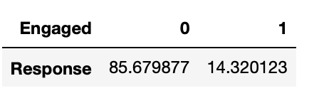

# Predicting Customer Engagement to Insurance Company Marketing Campaign
## Project Summary
This project aims to use descriptive analysis to draw insight into customer behavior and factors that drive customer engagement rate to the marketing campaign of the insurance policies. 
## Data Analysis and Visualization
This is to take a more detailed look at the data to understand better what data points we have and what pattern we can see.
### Engagement rate

About 14% of the customers responded to marketing campaign calls, and remaining 86% of the customers have not responded

### Sales Channels
