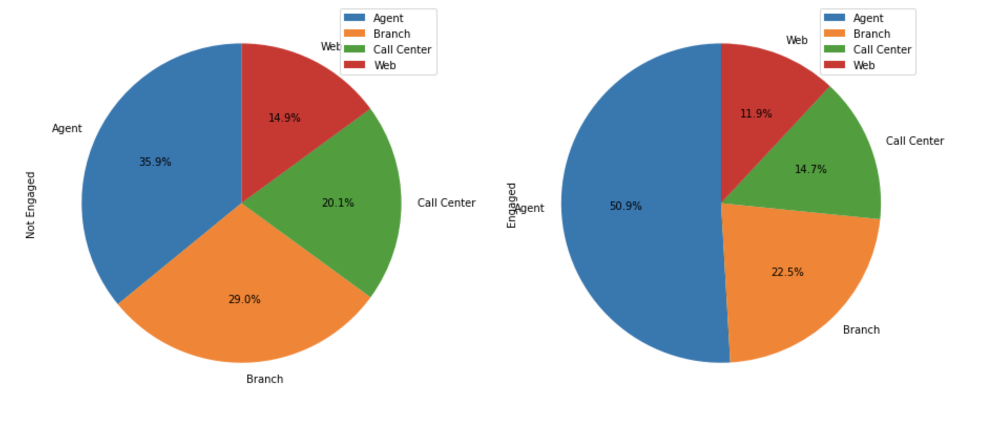
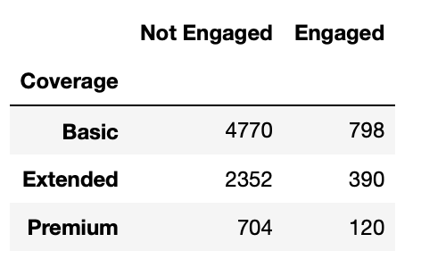
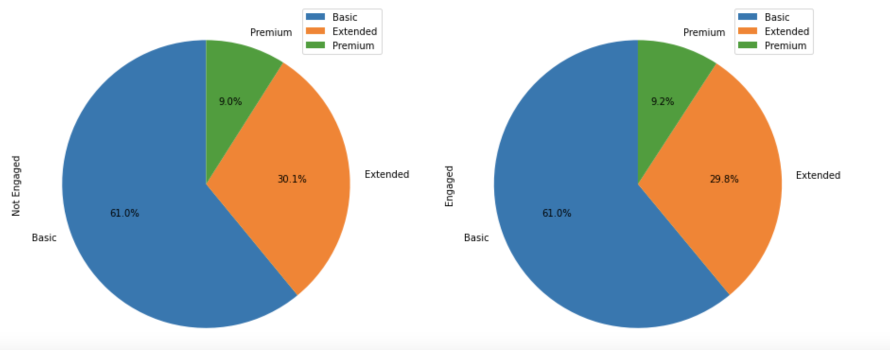
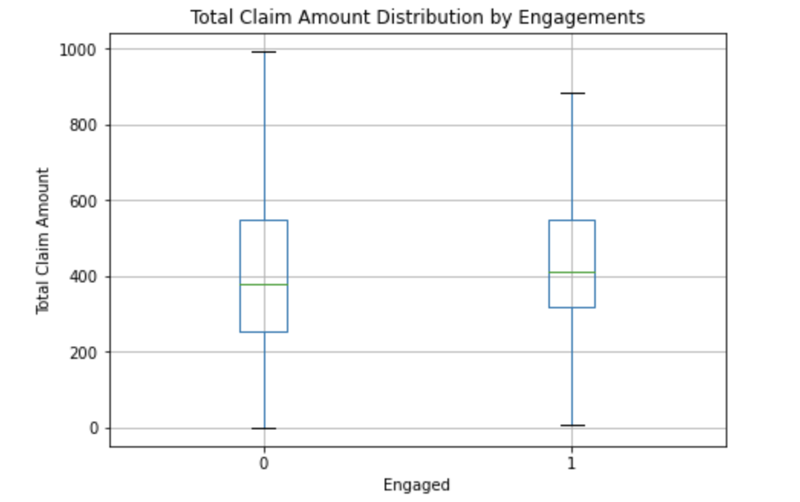
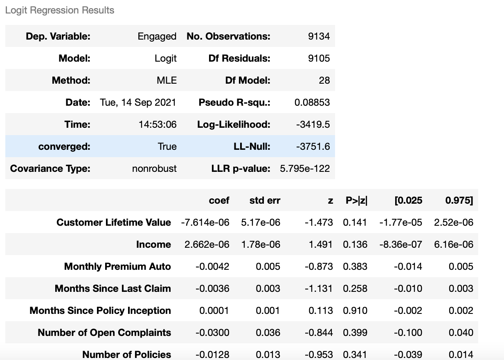

# Predicting Customer Engagement to Insurance Company Marketing Campaign
## Project Summary
This project aims to use descriptive analysis to draw insight into customer behavior and factors that drive customer engagement rate to the marketing campaign of the insurance policies. 
## Data Analysis and Visualization
This is to take a more detailed look at the data to understand better what data points we have and what pattern we can see.
### Engagement rate

- About 14% of the customers responded to marketing campaign calls, and remaining 86% of the customers have not responded

### Sales Channels

The above table helps visually explain the distribution between the engaged and non-engaged in each sales channel. About half of the engaged customers were from agents, whereas non-engaged customers are more evenly distributed across all four channels.
### Engagement by Coverage

There is an even distribution of engaged and non-engaged based on Coverage. 61% of the customers that engaged comes from customers signed up for basic premiums 

### Total Claim Amounts

The above boxplots show the distribution of the Total Claim Amount between the engaged and non-engaged groups
## Prediction
### Regression Analysis

